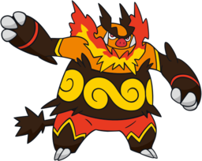
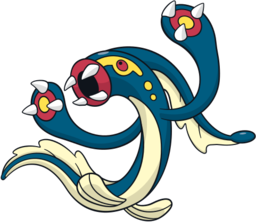
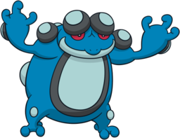
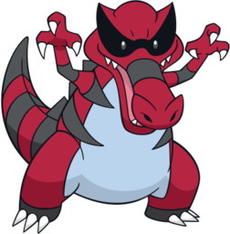
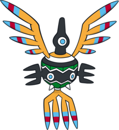
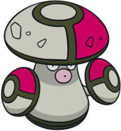

# Pokémon Black Team

---

## Emboar
  
### Moves
- Strength
- Bulldoze
- Flame Charge
- Brick Break
### Misc
- **Item:** Leftovers  
- **Ability:** Blaze  
- **Nature:** Docile  

---

## Eelektross
  
### Moves
- Acrobatics
- Thunder Wave
- Spark
- Crunch
### Misc
- **Item:** None  
- **Ability:** Levitate  
- **Nature:** Gentle  

---

## Seismitoad
  
### Moves
- Scald
- Surf
- Bulldoze
- Drain Punch
### Misc
- **Item:** Quick Claw  
- **Ability:** Poison Touch  
- **Nature:** Serious  

---

## Krookodile
  
### Moves
- Crunch
- Dig
- Shadow Claw
- Cut
### Misc
- **Item:** BlackGlasses  
- **Ability:** Moxie  
- **Nature:** Gentle  

---

## Sigilyph
  
### Moves
- Psychic
- Air Slash
- Tailwind
- Fly
### Misc
- **Item:** Scope Lens  
- **Ability:** Magic Guard  
- **Nature:** Adamant  

---

## Amoonguss
  
### Moves
- Giga Drain
- Toxic
- Sludge Bomb
- Faint Attack
### Misc
- **Item:** Big Root  
- **Ability:** Effect Spore  
- **Nature:** Bold  
