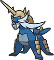
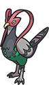
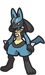
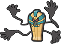

# Pokémon Black 2 Team

---

## Samurott (Katanari)
  
### Moves
- Surf
- Waterfall
- Swords Dance
- Cut
### Misc
- **Item:** Mystic Water  
- **Ability:** Torrent  
- **Nature:** Relaxed  

---

## Magnezone (Neodymia)
  
### Moves
- Thunderbolt
- Discharge
- Flash Cannon
- Thunder Wave
### Misc
- **Item:** Rocky Helmet  
- **Ability:** Magnet Pull  
- **Nature:** Quirky  

---

## Unfezant (Beakou)
  
### Moves
- Air Slash
- Fly
- Taunt
- Razor Wind
### Misc
- **Item:** Scope Lens  
- **Ability:** Super Luck  
- **Nature:** Docile  

---

## Claydol (Anubis)
  
### Moves
- Extrasensory
- AncientPower
- Charge Beam
- Earth Power
### Misc
- **Item:** Soft Sand  
- **Ability:** Levitate  
- **Nature:** Bashful  

---

## Lucario (Aurora)
  
### Moves
- Aura Sphere
- Bulldoze
- Return
- Strength
### Misc
- **Item:** Rocky Helmet  
- **Ability:** Steadfast  
- **Nature:** Timid  

---

## Cofagrigus (Khamun)
  
### Moves
- Shadow Ball
- Haze
- Return
- Hex
### Misc
- **Item:** Spell Tag  
- **Ability:** Mummy  
- **Nature:** Modest  
