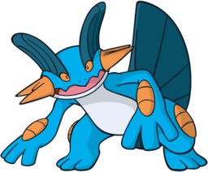
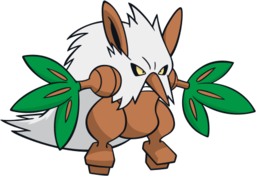
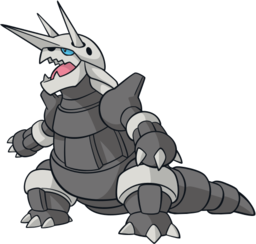
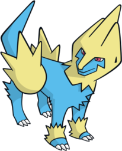
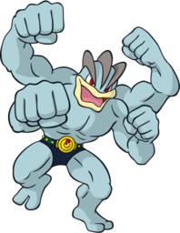

# Pokémon Leaf Green Team

---

## Swampert (Shrek)
  
### Moves
- Return
- Surf
- Earthquake
- Waterfall
### Misc
- **Item:** Mystic Water  
- **Ability:** Torrent  
- **Nature:** Quirky  

---

## Shiftry (Groot)
  
### Moves
- Cut
- Bullet Seed
- Giga Drain
- Faint Attack
### Misc
- **Item:** Miracle Seed  
- **Ability:** Chlorophyll  
- **Nature:** Bold  

---

## Aggron (Bismuth)
  
### Moves
- Iron Tail
- Rock Tomb
- Dig
- Strength
### Misc
- **Item:** Hard Stone  
- **Ability:** Sturdy  
- **Nature:** Modest  

---

## Altaria (Nimbus)
  
### Moves
- Aerial Ace
- Ice Beam
- Fly
- Dragonbreath
### Misc
- **Item:** King's Rock  
- **Ability:** Natural Cure  
- **Nature:** Modest  

---

## Manectric (Kilovolt)
  
### Moves
- Bite
- Flash
- Thunderbolt
- Shock Wave
### Misc
- **Item:** Magnet  
- **Ability:** Lightningrod  
- **Nature:** Gentle  

---

## Machamp (Sensei)
  
### Moves
- Return
- Rock Smash
- Cross Chop
- Karate Chop
### Misc
- **Item:** Quick Claw  
- **Ability:** Guts  
- **Nature:** Lax  
