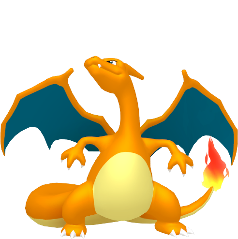
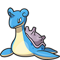
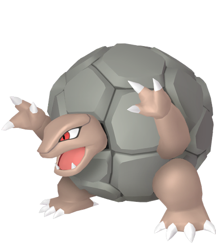
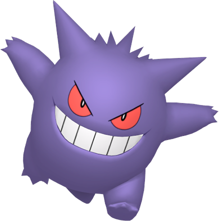

# Pokémon Fire Red Team

---

## Charizard (Salamandia)

  

### Moves

- Flamethrower (Level Up - L34)
- Fly (HM02 - Route 16)
- Dragon Claw (TM02 - Victory Road)
- Cut (HM01 - S.S. Anne)

### Misc

- **Item:** Charcoal  
- **Ability:** Blaze  
- **Nature:**  

---

## Lapras (Plessioria)

  

### Moves

- Surf (HM03 - Safari Zone)
- Waterfall (HM07 - Island 4)
- Ice Beam (Level Up - L31)
- Body Slam (Level Up - L13)

### Misc

- **Item:** Mystic Water  
- **Ability:**  
- **Nature**  

---

## Raichu (Zappazus)

  

### Moves

- Thunderbolt (Level Up - L26 - As Pikachu)
- Flash (HM05 - Route 2)
- Dig (TM28 - Cerulean City)
- Iron Tail (TM23 - Celadon Game Corner)

### Misc

- **Item:** Magnet  
- **Ability:**  
- **Nature:**  

---

## Golem (Feldspar)

  

### Moves

- Strength (HM04 - Safari Zone Warden)
- Earthquake (TM26 - Viridian Gym / Level Up - L45)
- Rock Smash (HM06 - Island 1)
- Return (TM27 - Route 12)

### Misc

- **Item:** Soft Sand  
- **Ability:**  
- **Nature:**  

---

## Exeggutor (Conucifera)

  

### Moves

- Sunny Day (TM11 - Safari Zone)
- SolarBeam (TM22 - Pokémon Mansion)
- Giga Drain (TM19 - Celadon Gym)
- Psychic (TM29 - Saffron City)

### Misc

- **Item:** Miracle Seed  
- **Ability:**  
- **Nature:**  

---

## Gengar (Doppégan)

  

### Moves

- Shadow Ball (Level Up - L45)
- Thunderbolt (TM24 - Celadon Game Corner)
- Thief (TM46 - Mt. Moon B2)
- Hypnosis (Level Up - L1)

### Misc

- **Item:** Spell Tag  
- **Ability:**  
- **Nature:**  
