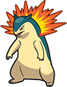
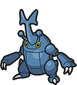
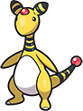
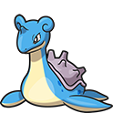
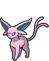
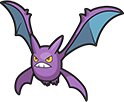

# Pokémon Heart Gold Team

---

## Typhlosion (Flamelash)
  
### Moves
- Cut
- Rock Smash
- Rock Climb
- Flamethrower
### Misc
- **Item:** Charcoal  
- **Ability:** Blaze  
- **Nature:** Jolly  

---

## Heracross (Mandible)
  
### Moves
- Aerial Ace
- Shadow Claw
- Brick Break
- Dig
### Misc
- **Item:** None  
- **Ability:** Swarm  
- **Nature:** Bold  

---

## Ampharos (V0LT4GE)
  
### Moves
- Flash
- Strength
- Discharge
- Signal Beam
### Misc
- **Item:** Quick Claw  
- **Ability:** Static  
- **Nature:** Quirky  

---

## Lapras (Nessiah)
  
### Moves
- Surf
- Ice Beam
- Waterfall
- Avalanche
### Misc
- **Item:** NeverMeltIce  
- **Ability:** Water Absorb  
- **Nature:** Naive  

---

## Espeon (Psycheleon)
  
### Moves
- Psybeam
- Swift
- Shadow Ball
- Psychic
### Misc
- **Item:** Choice Specs  
- **Ability:** Synchronize  
- **Nature:** Adamant  

---

## Crobat (Venom)
  
### Moves
- Poison Fang
- Bite
- Fly
- U-turn
### Misc
- **Item:** Amulet Coin  
- **Ability:** Inner Focus  
- **Nature:** Impish  
