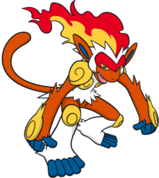
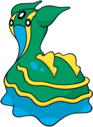
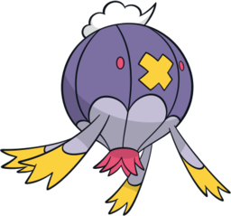
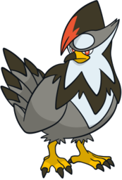
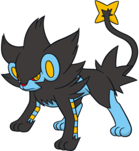
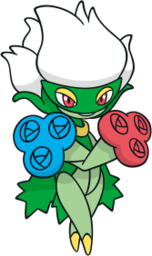

# Pokémon Platinum Team

---

## Infernape (Emberclaw)
  
### Moves
- Rock Climb
- Rock Smash
- Flame Wheel
- Close Combat
### Misc
- **Item:** Fist Plate  
- **Ability:** Blaze  
- **Nature:** Rash  

---

## Gastrodon (Slippy)
  
### Moves
- Surf
- Block
- Waterfall
- Ice Beam
### Misc
- **Item:** Mystic Water  
- **Ability:** Sticky Hold  
- **Nature:** Timid  

---

## Drifblim (Hindenburg)
  
### Moves
- Shock Wave
- Shadow Ball
- Fly
- Silver Wind
### Misc
- **Item:** Spell Tag  
- **Ability:** Unburden  
- **Nature:** Lonely  

---

## Staraptor (Skyrazor)
  
### Moves
- Aerial Ace
- Rain Dance
- Defog
- Close Combat
### Misc
- **Item:** King's Rock  
- **Ability:** Intimidate  
- **Nature:** Bold  

---

## Luxray (Voltshadow)
  
### Moves
- Spark
- Crunch
- Thunder Fang
- Strength
### Misc
- **Item:** BlackGlasses  
- **Ability:** Intimidate  
- **Nature:** Bold  

---

## Roserade (Nightshade)
  
### Moves
- Mega Drain
- Cut
- Sludge Bomb
- Energy Ball
### Misc
- **Item:** Big Root  
- **Ability:** Natural Cure  
- **Nature:** Rash  
