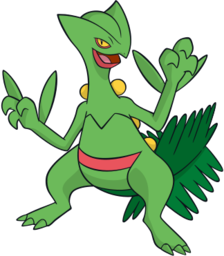
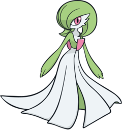
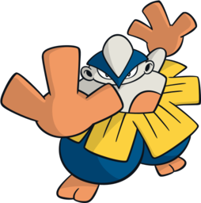
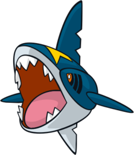
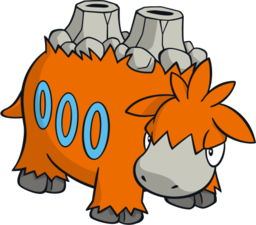

# Pokémon Ruby Team

---

## Sceptile (Evergreen)
  
### Moves
- Cut
- Flash
- Leaf Blade
- Quick Attack
### Misc
- **Item:** Miracle Seed  
- **Ability:** Overgrow  
- **Nature:** Hardy  

---

## Swellow (Swiftwing)
  
### Moves
- Aerial Ace
- Return
- Fly
- Steel Wing
### Misc
- **Item:** Silk Scarf  
- **Ability:** Guts  
- **Nature:** Modest  

---

## Gardevoir (Gardia)
  
### Moves
- Psychic
- Shadow Ball
- Calm Mind
- Thunderbolt
### Misc
- **Item:** Amulet Coin  
- **Ability:** Trace  
- **Nature:** Adamant  

---

## Hariyama (Taekwondai)
  
### Moves
- Vital Throw
- Rock Tomb
- Fake Out
- Rock Smash
### Misc
- **Item:** Quick Claw  
- **Ability:** Thick Fat  
- **Nature:** Brave  

---

## Sharpedo (Predatora)
  
### Moves
- Dive
- Ice Beam
- Surf
- Waterfall
### Misc
- **Item:** Mystic Water  
- **Ability:** Rough Skin  
- **Nature:** Relaxed  

---

## Camerupt (Volkamel)
  
### Moves
- Ember
- Strength
- Dig
- Earthquake
### Misc
- **Item:** Soft Sand  
- **Ability:** Magma Armor  
- **Nature:** Careful  
