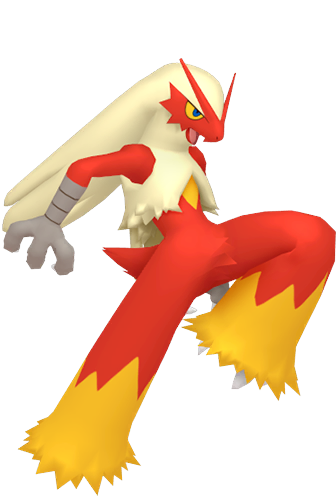
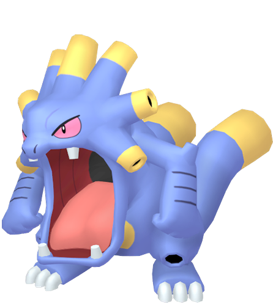
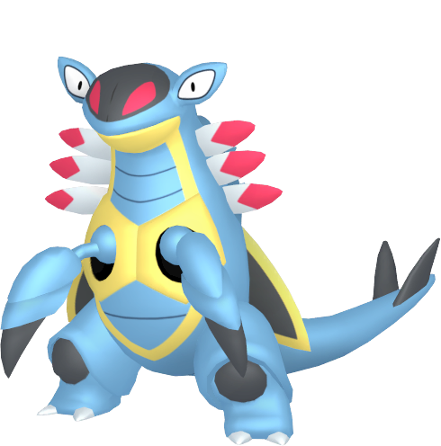
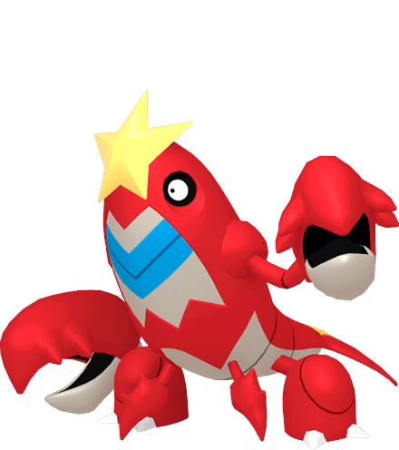
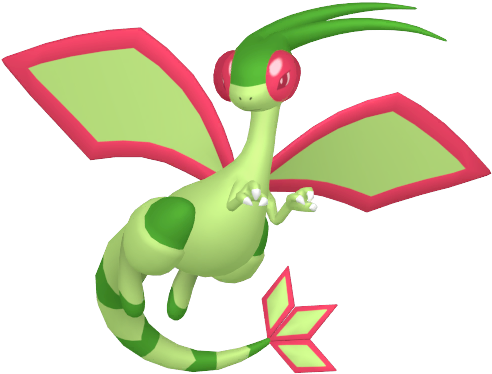
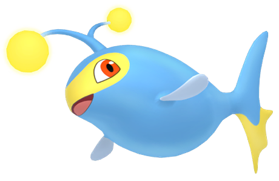

# Pokémon Sapphire Team

---

## Blaziken (Fawkes)

  

### Moves

- Flamethrower (TM35 - Mauville Game Corner)
- Slash (Level 42)
- Brick Break (Sootopolis City)
- Rock Smash (HM06 - Mauville City)

### Misc

- **Item:**  
- **Ability:** Blaze  
- **Nature:** Brave  

---

## Exploud (Drekkavakh)

  

### Moves

- Strength (HM04 - Rusturf Tunnel)
- Stomp (Level 29)
- Toxic (TM06 - Fiery Path)
- Facade (TM42 - Petalburg Gym)

### Misc

- **Location:** Rusturf Tunnel (Whismur)
- **Item:**  
- **Ability:** Soundproof  
- **Nature** Bold  

---

## Armaldo (Armandias)

  

### Moves

- Dig (TM28 - Route 114)
- AncientPower (Level 37)
- Metal Claw (Level 25)
- Cut (HM01 - Rustboro City)

### Misc

- **Location:** Rustboro City (Claw Fossil - Route 111)  
- **Item:**  
- **Ability:** Battle Armor  
- **Nature:**  

---

## Crawdaunt (Caraccinus)

  

### Moves

- Dive (HM08 - Mossdeep City)
- Surf (HM03 - Petalburg City)
- Sludge Bomb (TM36 - Dewford Town)
- Knock Off (Level 26)

### Misc

- **Location:** Route 102, 117, and Petalburg City (Good Rod/Super Rod)  
- **Item:**  
- **Ability:** Shell Armor  
- **Nature:**  

---

## Flygon (Pteransonia)

  

### Moves

- Dragon Claw (TM02 - Meteor Falls)
- Earthquake (TM26 - Seafloor Cavern)
- Steel Wing (TM47 - Granite Cave)
- Fly (HM02 - Route 119)

### Misc

- **Location:** Route 111
- **Item:**  
- **Ability:** Levitate  
- **Nature:**  

---

## Lanturn (Amphitrite)

  

### Moves

- Thunderbolt (TM24 - Mauville Game Corner)
- Ice Beam (TM13 - Sea Mauville)
- Flash (HM05 - Granite Cave)
- Waterfall (HM07 - Cave of Origin)

### Misc

- **Location:** Route 124 and 126 (Underwater)  
- **Item:**  
- **Ability:** Volt Absorb  
- **Nature:**  
