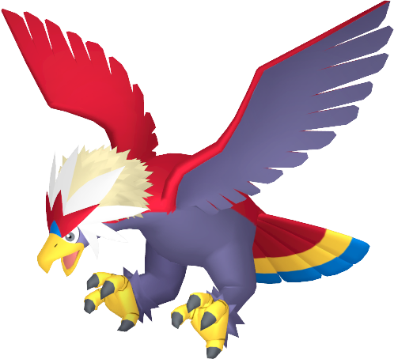
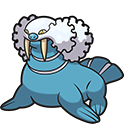
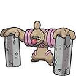
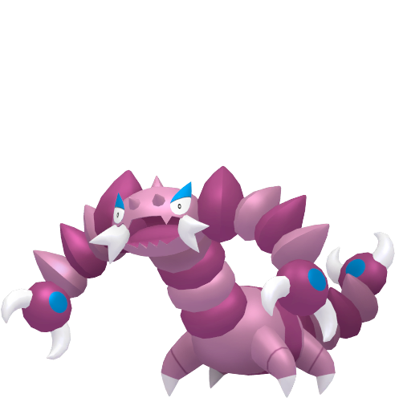

# Pokémon [Game] Team

---

## Serperior (Aconyte)

  

### Moves

- Energy Ball (TM - Aspertia City - Req. Surf)
- Cut (HM - Virbank City)
- Aerial Ace (TM - Mistralton Runway)
- Return (TM - Aspertia City)

### Misc

- **Item:** Miracle Seed (Castelia City)  
- **Ability:** Overgrow  
- **Nature:**  

---

## Braviary (Liberti)

  

### Moves

- Aerial Ace (Obtain)
- Slash (L28)
- Fly (HM - Route 5)
- Rock Slide (TM - Mistralton Cave)

### Misc

- **Item:** Sharp Beak (Mistralton City)  
- **Ability:** Defiant  
- **Nature:**  
- **Location:** Route 4 (Monday)  

---

## Cinccino (Lanigera)

  

### Moves

- Wake-Up Slap (L31 - Minccino)
- Thief (TM - Virbank Complex)
- Tail Slap (L25 - Minccino)
- Work Up (TM - Aspertia City)

### Misc

- **Item:** Silk Scarf (Virbank Complex)  
- **Ability:** Technician  
- **Nature:**  
- **Location:** Route 16 (Minccino) - Route 6 Gift (Shiny Stone)  

---

## Walrein (Tursus)

  

### Moves

- Surf (HM - Route 6)
- Waterfall (HM - Victory Road)
- Ice Beam (TM - Giant Chasm)
- Rain Dance (TM - Mistralton Pokémart - $50,000)

### Misc

- **Item:** Mystic Water (Route 4)  
- **Ability:** Thick Fat  
- **Nature:**  
- **Location:** Undella Bay - Surf - Winter (Spheal)  

---

## Conkeldurr (Concresca)

  

### Moves

- Strength (HM - Castelia Sewers)
- Bulldoze (TM - Driftveil City)
- Rock Slide (L33)
- Wake-Up Slap (L20 - Timburr)

### Misc

- **Item:** Life Orb (Battle Subway - 24BP)  
- **Ability:** Sheer Force  
- **Nature:**  
- **Location:** Relic Passage (Timburr)  

---

## Drapion (Quistriatus)

  

### Moves

- Poison Fang (L23 - Skorupi)
- False Swipe (TM - Reversal Mountain)
- Night Slash (L38 - Skorupi)
- Dig (TM - Route 4)

### Misc

- **Item:** Scope Lens (Castelia City)  
- **Ability:** Sniper  
- **Nature:**  
- **Location:** Reversal Mountain (Skorupi)  
